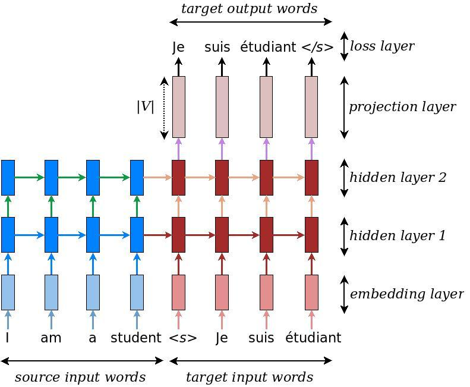
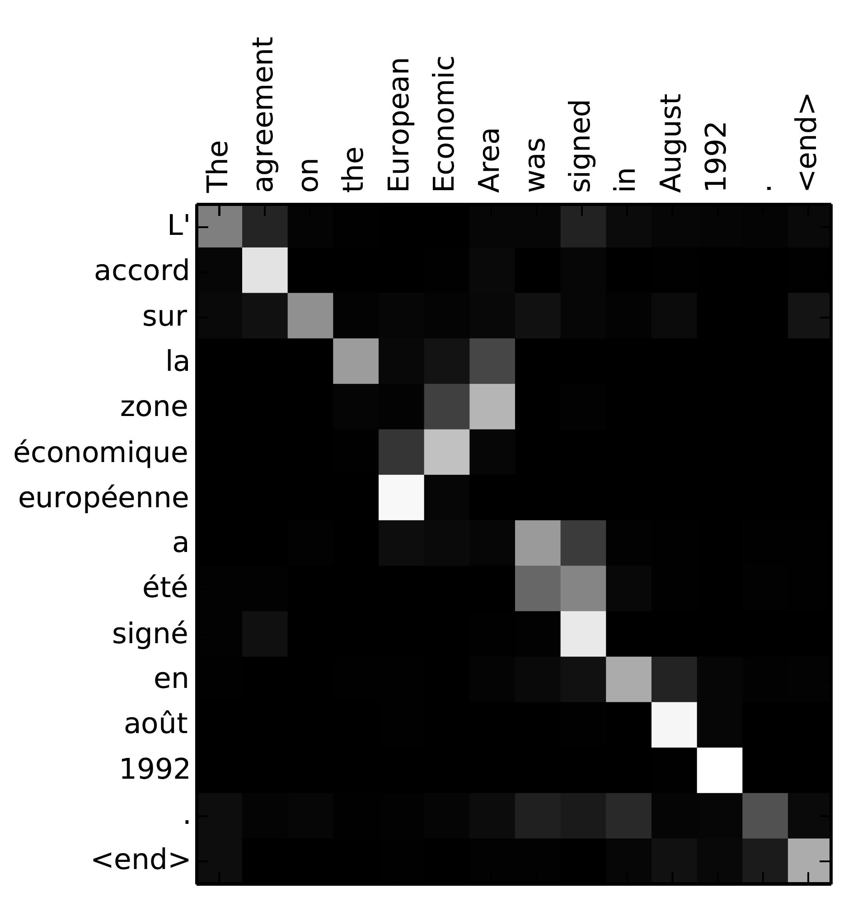

# Lab IIS NMT Project
Virtul env is necessary, that means tf-nightly version should be standing alone(without stable tensorflow) 

All required data are located in /nmt_data directory.

Train and test commands on the shell are located in COMMANDS.md file.

Requirements needed to download could be installed by the following command in the bash:
``` bash
pip install -f requirements.txt 
```

# Neural Machine Translation (seq2seq) Tutorial

*Authors: Thang Luong, Eugene Brevdo, Rui Zhao ([Google Research Blogpost](https://research.googleblog.com/2017/07/building-your-own-neural-machine.html), [Github](https://github.com/tensorflow/nmt))*

*This version of the tutorial requires [TensorFlow Nightly](https://github.com/tensorflow/tensorflow/#installation).
For using the stable TensorFlow versions, please consider other branches such as
[tf-1.4](https://github.com/tensorflow/nmt/tree/tf-1.4).*

*If make use of this codebase for your research, please cite
[this](#bibtex).*

- [Introduction](#introduction)
- [Basic](#basic)
   - [Background on Neural Machine Translation](#background-on-neural-machine-translation)
   - [Installing the Tutorial](#installing-the-tutorial)
   - [Training – *How to build our first NMT system*](#training--how-to-build-our-first-nmt-system)
      - [Embedding](#embedding)
      - [Encoder](#encoder)
      - [Decoder](#decoder)
      - [Loss](#loss)
      - [Gradient computation & optimization](#gradient-computation--optimization)
   - [Hands-on – *Let's train an NMT model*](#hands-on--lets-train-an-nmt-model)
   - [Inference – *How to generate translations*](#inference--how-to-generate-translations)
- [Intermediate](#intermediate)
   - [Background on the Attention Mechanism](#background-on-the-attention-mechanism)
   - [Attention Wrapper API](#attention-wrapper-api)
   - [Hands-on – *Building an attention-based NMT model*](#hands-on--building-an-attention-based-nmt-model)
- [Tips & Tricks](#tips--tricks)
   - [Building Training, Eval, and Inference Graphs](#building-training-eval-and-inference-graphs)
   - [Data Input Pipeline](#data-input-pipeline)
   - [Other details for better NMT models](#other-details-for-better-nmt-models)
      - [Bidirectional RNNs](#bidirectional-rnns)
      - [Beam search](#beam-search)
      - [Hyperparameters](#hyperparameters)
      - [Multi-GPU training](#multi-gpu-training)
- [Benchmarks](#benchmarks)
   - [IWSLT English-Vietnamese](#iwslt-english-vietnamese)
   - [WMT German-English](#wmt-german-english)
   - [WMT English-German &mdash; *Full Comparison*](#wmt-english-german--full-comparison)
   - [Standard HParams](#standard-hparams)
- [Other resources](#other-resources)
- [Acknowledgment](#acknowledgment)
- [References](#references)
- [BibTex](#bibtex)


# Introduction

Sequence-to-sequence (seq2seq) models
([Sutskever et al., 2014](https://papers.nips.cc/paper/5346-sequence-to-sequence-learning-with-neural-networks.pdf),
[Cho et al., 2014](http://emnlp2014.org/papers/pdf/EMNLP2014179.pdf)) have
enjoyed great success in a variety of tasks such as machine translation, speech
recognition, and text summarization. This tutorial gives readers a full
understanding of seq2seq models and shows how to build a competitive seq2seq
model from scratch. We focus on the task of Neural Machine Translation (NMT)
which was the very first testbed for seq2seq models with
wild
[success](https://research.googleblog.com/2016/09/a-neural-network-for-machine.html). The
included code is lightweight, high-quality, production-ready, and incorporated
with the latest research ideas. We achieve this goal by:

1. Using the recent decoder / attention
   wrapper
   [API](https://github.com/tensorflow/tensorflow/tree/master/tensorflow/contrib/seq2seq/python/ops),
   TensorFlow 1.2 data iterator
1. Incorporating our strong expertise in building recurrent and seq2seq models
1. Providing tips and tricks for building the very best NMT models and replicating
   [Google’s NMT (GNMT) system](https://research.google.com/pubs/pub45610.html).

We believe that it is important to provide benchmarks that people can easily
replicate. As a result, we have provided full experimental results and
pretrained on models on the following publicly available datasets:

1. *Small-scale*: English-Vietnamese parallel corpus of TED talks (133K sentence
   pairs) provided by
   the
   [IWSLT Evaluation Campaign](https://sites.google.com/site/iwsltevaluation2015/).
1. *Large-scale*: German-English parallel corpus (4.5M sentence pairs) provided
   by the [WMT Evaluation Campaign](http://www.statmt.org/wmt16/translation-task.html).

We first build up some basic knowledge about seq2seq models for NMT, explaining
how to build and train a vanilla NMT model. The second part will go into details
of building a competitive NMT model with attention mechanism. We then discuss
tips and tricks to build the best possible NMT models (both in speed and
translation quality) such as TensorFlow best practices (batching, bucketing),
bidirectional RNNs, beam search, as well as scaling up to multiple GPUs using GNMT attention.

# Basic

## Background on Neural Machine Translation

Back in the old days, traditional phrase-based translation systems performed
their task by breaking up source sentences into multiple chunks and then
translated them phrase-by-phrase. This led to disfluency in the translation
outputs and was not quite like how we, humans, translate. We read the entire
source sentence, understand its meaning, and then produce a translation. Neural
Machine Translation (NMT) mimics that!

<p align="center">

<br>
Figure 1. <b>Encoder-decoder architecture</b> – example of a general approach for
NMT. An encoder converts a source sentence into a "meaning" vector which is
passed through a <i>decoder</i> to produce a translation.
</p>

Specifically, an NMT system first reads the source sentence using an *encoder*
to build
a
["thought" vector](https://www.theguardian.com/science/2015/may/21/google-a-step-closer-to-developing-machines-with-human-like-intelligence),
a sequence of numbers that represents the sentence meaning; a *decoder*, then,
processes the sentence vector to emit a translation, as illustrated in
Figure 1. This is often referred to as the *encoder-decoder architecture*. In
this manner, NMT addresses the local translation problem in the traditional
phrase-based approach: it can capture *long-range dependencies* in languages,
e.g., gender agreements; syntax structures; etc., and produce much more fluent
translations as demonstrated
by
[Google Neural Machine Translation systems](https://research.googleblog.com/2016/09/a-neural-network-for-machine.html).

NMT models vary in terms of their exact architectures. A natural choice for
sequential data is the recurrent neural network (RNN), used by most NMT models.
Usually an RNN is used for both the encoder and decoder. The RNN models,
however, differ in terms of: (a) *directionality* – unidirectional or
bidirectional; (b) *depth* – single- or multi-layer; and (c) *type* – often
either a vanilla RNN, a Long Short-term Memory (LSTM), or a gated recurrent unit
(GRU). Interested readers can find more information about RNNs and LSTM on
this [blog post](http://colah.github.io/posts/2015-08-Understanding-LSTMs/).

In this tutorial, we consider as examples a *deep multi-layer RNN* which is
unidirectional and uses LSTM as a recurrent unit. We show an example of such a
model in Figure 2. In this example, we build a model to translate a source
sentence "I am a student" into a target sentence "Je suis étudiant". At a high
level, the NMT model consists of two recurrent neural networks: the *encoder*
RNN simply consumes the input source words without making any prediction; the
*decoder*, on the other hand, processes the target sentence while predicting the
next words.

For more information, we refer readers
to [Luong (2016)](https://github.com/lmthang/thesis) which this tutorial is
based on.

<p align="center">

<br>
Figure 2. <b>Neural machine translation</b> – example of a deep recurrent
architecture proposed by for translating a source sentence "I am a student" into
a target sentence "Je suis étudiant". Here, "&lts&gt" marks the start of the
decoding process while "&lt/s&gt" tells the decoder to stop.
</p>

## Installing the Tutorial

To install this tutorial, you need to have TensorFlow installed on your system.
This tutorial requires TensorFlow Nightly. To install TensorFlow, follow
the [installation instructions here](https://www.tensorflow.org/install/).

Once TensorFlow is installed, you can download the source code of this tutorial
by running:

``` shell
git clone https://github.com/tensorflow/nmt/
```

## Training – How to build our first NMT system

Let's first dive into the heart of building an NMT model with concrete code
snippets through which we will explain Figure 2 in more detail. We defer data
preparation and the full code to later. This part refers to
file
[**model.py**](nmt/model.py).

At the bottom layer, the encoder and decoder RNNs receive as input the
following: first, the source sentence, then a boundary marker "\<s\>" which
indicates the transition from the encoding to the decoding mode, and the target
sentence.  For *training*, we will feed the system with the following tensors,
which are in time-major format and contain word indices:

-  **encoder_inputs** [max_encoder_time, batch_size]: source input words.
-  **decoder_inputs** [max_decoder_time, batch_size]: target input words.
-  **decoder_outputs** [max_decoder_time, batch_size]: target output words,
   these are decoder_inputs shifted to the left by one time step with an
   end-of-sentence tag appended on the right.

Here for efficiency, we train with multiple sentences (batch_size) at
once. Testing is slightly different, so we will discuss it later.

### Embedding

Given the categorical nature of words, the model must first look up the source
and target embeddings to retrieve the corresponding word representations. For
this *embedding layer* to work, a vocabulary is first chosen for each language.
Usually, a vocabulary size V is selected, and only the most frequent V words are
treated as unique.  All other words are converted to an "unknown" token and all
get the same embedding.  The embedding weights, one set per language, are
usually learned during training.

``` python
# Embedding
embedding_encoder = variable_scope.get_variable(
    "embedding_encoder", [src_vocab_size, embedding_size], ...)
# Look up embedding:
#   encoder_inputs: [max_time, batch_size]
#   encoder_emb_inp: [max_time, batch_size, embedding_size]
encoder_emb_inp = embedding_ops.embedding_lookup(
    embedding_encoder, encoder_inputs)
```

Similarly, we can build *embedding_decoder* and *decoder_emb_inp*. Note that one
can choose to initialize embedding weights with pretrained word representations
such as word2vec or Glove vectors. In general, given a large amount of training
data we can learn these embeddings from scratch.

### Encoder

Once retrieved, the word embeddings are then fed as input into the main network,
which consists of two multi-layer RNNs – an encoder for the source language and
a decoder for the target language. These two RNNs, in principle, can share the
same weights; however, in practice, we often use two different RNN parameters
(such models do a better job when fitting large training datasets). The
*encoder* RNN uses zero vectors as its starting states and is built as follows:

``` python
# Build RNN cell
encoder_cell = tf.nn.rnn_cell.BasicLSTMCell(num_units)

# Run Dynamic RNN
#   encoder_outputs: [max_time, batch_size, num_units]
#   encoder_state: [batch_size, num_units]
encoder_outputs, encoder_state = tf.nn.dynamic_rnn(
    encoder_cell, encoder_emb_inp,
    sequence_length=source_sequence_length, time_major=True)
```

Note that sentences have different lengths to avoid wasting computation, we tell
*dynamic_rnn* the exact source sentence lengths through
*source_sequence_length*. Since our input is time major, we set
*time_major=True*. Here, we build only a single layer LSTM, *encoder_cell*. We
will describe how to build multi-layer LSTMs, add dropout, and use attention in
a later section.

### Decoder

The *decoder* also needs to have access to the source information, and one
simple way to achieve that is to initialize it with the last hidden state of the
encoder, *encoder_state*. In Figure 2, we pass the hidden state at the source
word "student" to the decoder side.

``` python
# Build RNN cell
decoder_cell = tf.nn.rnn_cell.BasicLSTMCell(num_units)
```

``` python
# Helper
helper = tf.contrib.seq2seq.TrainingHelper(
    decoder_emb_inp, decoder_lengths, time_major=True)
# Decoder
decoder = tf.contrib.seq2seq.BasicDecoder(
    decoder_cell, helper, encoder_state,
    output_layer=projection_layer)
# Dynamic decoding
outputs, _ = tf.contrib.seq2seq.dynamic_decode(decoder, ...)
logits = outputs.rnn_output
```

Here, the core part of this code is the *BasicDecoder* object, *decoder*, which
receives *decoder_cell* (similar to encoder_cell), a *helper*, and the previous
*encoder_state* as inputs. By separating out decoders and helpers, we can reuse
different codebases, e.g., *TrainingHelper* can be substituted with
*GreedyEmbeddingHelper* to do greedy decoding. See more
in
[helper.py](https://github.com/tensorflow/tensorflow/blob/master/tensorflow/contrib/seq2seq/python/ops/helper.py).

Lastly, we haven't mentioned *projection_layer* which is a dense matrix to turn
the top hidden states to logit vectors of dimension V. We illustrate this
process at the top of Figure 2.

``` python
projection_layer = layers_core.Dense(
    tgt_vocab_size, use_bias=False)
```

### Loss

Given the *logits* above, we are now ready to compute our training loss:

``` python
crossent = tf.nn.sparse_softmax_cross_entropy_with_logits(
    labels=decoder_outputs, logits=logits)
train_loss = (tf.reduce_sum(crossent * target_weights) /
    batch_size)
```

Here, *target_weights* is a zero-one matrix of the same size as
*decoder_outputs*. It masks padding positions outside of the target sequence
lengths with values 0.

***Important note***: It's worth pointing out that we divide the loss by
*batch_size*, so our hyperparameters are "invariant" to batch_size. Some people
divide the loss by (*batch_size* * *num_time_steps*), which plays down the
errors made on short sentences. More subtly, our hyperparameters (applied to the
former way) can't be used for the latter way. For example, if both approaches
use SGD with a learning of 1.0, the latter approach effectively uses a much
smaller learning rate of 1 / *num_time_steps*.

### Gradient computation & optimization

We have now defined the forward pass of our NMT model. Computing the
backpropagation pass is just a matter of a few lines of code:

``` python
# Calculate and clip gradients
params = tf.trainable_variables()
gradients = tf.gradients(train_loss, params)
clipped_gradients, _ = tf.clip_by_global_norm(
    gradients, max_gradient_norm)
```

One of the important steps in training RNNs is gradient clipping. Here, we clip
by the global norm.  The max value, *max_gradient_norm*, is often set to a value
like 5 or 1. The last step is selecting the optimizer.  The Adam optimizer is a
common choice.  We also select a learning rate.  The value of *learning_rate*
can is usually in the range 0.0001 to 0.001; and can be set to decrease as
training progresses.

``` python
# Optimization
optimizer = tf.train.AdamOptimizer(learning_rate)
update_step = optimizer.apply_gradients(
    zip(clipped_gradients, params))
```

In our own experiments, we use standard SGD (tf.train.GradientDescentOptimizer)
with a decreasing learning rate schedule, which yields better performance. See
the [benchmarks](#benchmarks).

## Hands-on – Let's train an NMT model

Let's train our very first NMT model, translating from Vietnamese to English!
The entry point of our code
is
[**nmt.py**](nmt/nmt.py).

We will use a *small-scale parallel corpus of TED talks* (133K training
examples) for this exercise. All data we used here can be found
at:
[https://nlp.stanford.edu/projects/nmt/](https://nlp.stanford.edu/projects/nmt/). We
will use tst2012 as our dev dataset, and tst2013 as our test dataset.

Run the following command to download the data for training NMT model:\
	`nmt/scripts/download_iwslt15.sh /tmp/nmt_data`

Run the following command to start the training:

``` shell
mkdir /tmp/nmt_model
python -m nmt.nmt \
    --src=vi --tgt=en \
    --vocab_prefix=/tmp/nmt_data/vocab  \
    --train_prefix=/tmp/nmt_data/train \
    --dev_prefix=/tmp/nmt_data/tst2012  \
    --test_prefix=/tmp/nmt_data/tst2013 \
    --out_dir=/tmp/nmt_model \
    --num_train_steps=12000 \
    --steps_per_stats=100 \
    --num_layers=2 \
    --num_units=128 \
    --dropout=0.2 \
    --metrics=bleu
```

The above command trains a 2-layer LSTM seq2seq model with 128-dim hidden units
and embeddings for 12 epochs. We use a dropout value of 0.2 (keep probability
0.8). If no error, we should see logs similar to the below with decreasing
perplexity values as we train.

```
# First evaluation, global step 0
  eval dev: perplexity 17193.66
  eval test: perplexity 17193.27
# Start epoch 0, step 0, lr 1, Tue Apr 25 23:17:41 2017
  sample train data:
    src_reverse: </s> </s> Điều đó , dĩ nhiên , là câu chuyện trích ra từ học thuyết của Karl Marx .
    ref: That , of course , was the <unk> distilled from the theories of Karl Marx . </s> </s> </s>
  epoch 0 step 100 lr 1 step-time 0.89s wps 5.78K ppl 1568.62 bleu 0.00
  epoch 0 step 200 lr 1 step-time 0.94s wps 5.91K ppl 524.11 bleu 0.00
  epoch 0 step 300 lr 1 step-time 0.96s wps 5.80K ppl 340.05 bleu 0.00
  epoch 0 step 400 lr 1 step-time 1.02s wps 6.06K ppl 277.61 bleu 0.00
  epoch 0 step 500 lr 1 step-time 0.95s wps 5.89K ppl 205.85 bleu 0.00
```

See [**train.py**](nmt/train.py) for more details.

We can start Tensorboard to view the summary of the model during training:

``` shell
tensorboard --port 22222 --logdir /tmp/nmt_model/
```

Training the reverse direction from English and Vietnamese can be done simply by changing:\
	`--src=en --tgt=vi`

## Inference – How to generate translations

While you're training your NMT models (and once you have trained models), you
can obtain translations given previously unseen source sentences. This process
is called inference. There is a clear distinction between training and inference
(*testing*): at inference time, we only have access to the source sentence,
i.e., *encoder_inputs*. There are many ways to perform decoding.  Decoding
methods include greedy, sampling, and beam-search decoding. Here, we will
discuss the greedy decoding strategy.

The idea is simple and we illustrate it in Figure 3:

1. We still encode the source sentence in the same way as during training to
   obtain an *encoder_state*, and this *encoder_state* is used to initialize the
   decoder.
2. The decoding (translation) process is started as soon as the decoder receives
   a starting symbol "\<s\>" (refer as *tgt_sos_id* in our code);
3. For each timestep on the decoder side, we treat the RNN's output as a set of
   logits.  We choose the most likely word, the id associated with the maximum
   logit value, as the emitted word (this is the "greedy" behavior).  For
   example in Figure 3, the word "moi" has the highest translation probability
   in the first decoding step.  We then feed this word as input to the next
   timestep.
4. The process continues until the end-of-sentence marker "\</s\>" is produced as
   an output symbol (refer as *tgt_eos_id* in our code).

<p align="center">

<br>
Figure 3. <b>Greedy decoding</b> – example of how a trained NMT model produces a
translation for a source sentence "Je suis étudiant" using greedy search.
</p>

Step 3 is what makes inference different from training. Instead of always
feeding the correct target words as an input, inference uses words predicted by
the model. Here's the code to achieve greedy decoding.  It is very similar to
the training decoder.

``` python
# Helper
helper = tf.contrib.seq2seq.GreedyEmbeddingHelper(
    embedding_decoder,
    tf.fill([batch_size], tgt_sos_id), tgt_eos_id)

# Decoder
decoder = tf.contrib.seq2seq.BasicDecoder(
    decoder_cell, helper, encoder_state,
    output_layer=projection_layer)
# Dynamic decoding
outputs, _ = tf.contrib.seq2seq.dynamic_decode(
    decoder, maximum_iterations=maximum_iterations)
translations = outputs.sample_id
```

Here, we use *GreedyEmbeddingHelper* instead of *TrainingHelper*. Since we do
not know the target sequence lengths in advance, we use *maximum_iterations* to
limit the translation lengths. One heuristic is to decode up to two times the
source sentence lengths.

``` python
maximum_iterations = tf.round(tf.reduce_max(source_sequence_length) * 2)
```

Having trained a model, we can now create an inference file and translate some
sentences:

``` shell
cat > /tmp/my_infer_file.vi
# (copy and paste some sentences from /tmp/nmt_data/tst2013.vi)

python -m nmt.nmt \
    --out_dir=/tmp/nmt_model \
    --inference_input_file=/tmp/my_infer_file.vi \
    --inference_output_file=/tmp/nmt_model/output_infer

cat /tmp/nmt_model/output_infer # To view the inference as output
```

Note the above commands can also be run while the model is still being trained
as long as there exists a training
checkpoint. See [**inference.py**](nmt/inference.py) for more details.

# Intermediate

Having gone through the most basic seq2seq model, let's get more advanced! To
build state-of-the-art neural machine translation systems, we will need more
"secret sauce": the *attention mechanism*, which was first introduced
by [Bahdanau et al., 2015](https://arxiv.org/abs/1409.0473), then later refined
by [Luong et al., 2015](https://arxiv.org/abs/1508.04025) and others. The key
idea of the attention mechanism is to establish direct short-cut connections
between the target and the source by paying "attention" to relevant source
content as we translate. A nice byproduct of the attention mechanism is an
easy-to-visualize alignment matrix between the source and target sentences (as
shown in Figure 4).

<p align="center">

<br>
Figure 4. <b>Attention visualization</b> – example of the alignments between source
and target sentences. Image is taken from (Bahdanau et al., 2015).
</p>

Remember that in the vanilla seq2seq model, we pass the last source state from
the encoder to the decoder when starting the decoding process. This works well
for short and medium-length sentences; however, for long sentences, the single
fixed-size hidden state becomes an information bottleneck. Instead of discarding
all of the hidden states computed in the source RNN, the attention mechanism
provides an approach that allows the decoder to peek at them (treating them as a
dynamic memory of the source information). By doing so, the attention mechanism
improves the translation of longer sentences. Nowadays, attention mechanisms are
the defacto standard and have been successfully applied to many other tasks
(including image caption generation, speech recognition, and text
summarization).

## Background on the Attention Mechanism

We now describe an instance of the attention mechanism proposed in (Luong et
al., 2015), which has been used in several state-of-the-art systems including
open-source toolkits such as [OpenNMT](http://opennmt.net/about/) and in the TF
seq2seq API in this tutorial. We will also provide connections to other variants
of the attention mechanism.

<p align="center">

<br>
Figure 5. <b>Attention mechanism</b> – example of an attention-based NMT system
as described in (Luong et al., 2015) . We highlight in detail the first step of
the attention computation. For clarity, we don't show the embedding and
projection layers in Figure (2).
</p>

As illustrated in Figure 5, the attention computation happens at every decoder
time step.  It consists of the following stages:

1. The current target hidden state is compared with all source states to derive
   *attention weights* (can be visualized as in Figure 4).
1. Based on the attention weights we compute a *context vector* as the weighted
   average of the source states.
1. Combine the context vector with the current target hidden state to yield the
   final *attention vector*
1. The attention vector is fed as an input to the next time step (*input
   feeding*).  The first three steps can be summarized by the equations below:

<p align="center">

<br>
</p>

Here, the function `score` is used to compared the target hidden state $$h_t$$
with each of the source hidden states $$\overline{h}_s$$, and the result is normalized to
produced attention weights (a distribution over source positions). There are
various choices of the scoring function; popular scoring functions include the
multiplicative and additive forms given in Eq. (4). Once computed, the attention
vector $$a_t$$ is used to derive the softmax logit and loss.  This is similar to the
target hidden state at the top layer of a vanilla seq2seq model. The function
`f` can also take other forms.

<p align="center">

<br>
</p>

Various implementations of attention mechanisms can be found
in
[attention_wrapper.py](https://github.com/tensorflow/tensorflow/blob/master/tensorflow/contrib/seq2seq/python/ops/attention_wrapper.py).

***What matters in the attention mechanism?***

As hinted in the above equations, there are many different attention variants.
These variants depend on the form of the scoring function and the attention
function, and on whether the previous state $$h_{t-1}$$ is used instead of
$$h_t$$ in the scoring function as originally suggested in (Bahdanau et al.,
2015). Empirically, we found that only certain choices matter. First, the basic
form of attention, i.e., direct connections between target and source, needs to
be present. Second, it's important to feed the attention vector to the next
timestep to inform the network about past attention decisions as demonstrated in
(Luong et al., 2015). Lastly, choices of the scoring function can often result
in different performance. See more in the [benchmark results](#benchmarks)
section.

## Attention Wrapper API

In our implementation of
the
[AttentionWrapper](https://github.com/tensorflow/tensorflow/blob/master/tensorflow/contrib/seq2seq/python/ops/attention_wrapper.py),
we borrow some terminology
from [(Weston et al., 2015)](https://arxiv.org/abs/1410.3916) in their work on
*memory networks*. Instead of having readable & writable memory, the attention
mechanism presented in this tutorial is a *read-only* memory. Specifically, the
set of source hidden states (or their transformed versions, e.g.,
$$W\overline{h}_s$$ in Luong's scoring style or $$W_2\overline{h}_s$$ in
Bahdanau's scoring style) is referred to as the *"memory"*. At each time step,
we use the current target hidden state as a *"query"* to decide on which parts
of the memory to read.  Usually, the query needs to be compared with keys
corresponding to individual memory slots. In the above presentation of the
attention mechanism, we happen to use the set of source hidden states (or their
transformed versions, e.g., $$W_1h_t$$ in Bahdanau's scoring style) as
"keys". One can be inspired by this memory-network terminology to derive other
forms of attention!

Thanks to the attention wrapper, extending our vanilla seq2seq code with
attention is trivial. This part refers to
file [**attention_model.py**](nmt/attention_model.py)

First, we need to define an attention mechanism, e.g., from (Luong et al.,
2015):

``` python
# attention_states: [batch_size, max_time, num_units]
attention_states = tf.transpose(encoder_outputs, [1, 0, 2])

# Create an attention mechanism
attention_mechanism = tf.contrib.seq2seq.LuongAttention(
    num_units, attention_states,
    memory_sequence_length=source_sequence_length)
```

In the previous [Encoder](#encoder) section, *encoder_outputs* is the set of all
source hidden states at the top layer and has the shape of *[max_time,
batch_size, num_units]* (since we use *dynamic_rnn* with *time_major* set to
*True* for efficiency). For the attention mechanism, we need to make sure the
"memory" passed in is batch major, so we need to transpose
*attention_states*. We pass *source_sequence_length* to the attention mechanism
to ensure that the attention weights are properly normalized (over non-padding
positions only).

Having defined an attention mechanism, we use *AttentionWrapper* to wrap the
decoding cell:

``` python
decoder_cell = tf.contrib.seq2seq.AttentionWrapper(
    decoder_cell, attention_mechanism,
    attention_layer_size=num_units)
```

The rest of the code is almost the same as in the Section [Decoder](#decoder)!

## Hands-on – building an attention-based NMT model

To enable attention, we need to use one of `luong`, `scaled_luong`, `bahdanau`
or `normed_bahdanau` as the value of the `attention` flag during training. The
flag specifies which attention mechanism we are going to use. In addition, we
need to create a new directory for the attention model, so we don't reuse the
previously trained basic NMT model.

Run the following command to start the training:

``` shell
mkdir /tmp/nmt_attention_model

python -m nmt.nmt \
    --attention=scaled_luong \
    --src=vi --tgt=en \
    --vocab_prefix=/tmp/nmt_data/vocab  \
    --train_prefix=/tmp/nmt_data/train \
    --dev_prefix=/tmp/nmt_data/tst2012  \
    --test_prefix=/tmp/nmt_data/tst2013 \
    --out_dir=/tmp/nmt_attention_model \
    --num_train_steps=12000 \
    --steps_per_stats=100 \
    --num_layers=2 \
    --num_units=128 \
    --dropout=0.2 \
    --metrics=bleu
```

After training, we can use the same inference command with the new out_dir for
inference:

``` shell
python -m nmt.nmt \
    --out_dir=/tmp/nmt_attention_model \
    --inference_input_file=/tmp/my_infer_file.vi \
    --inference_output_file=/tmp/nmt_attention_model/output_infer
```

# Tips & Tricks

## Building Training, Eval, and Inference Graphs

When building a machine learning model in TensorFlow, it's often best to build
three separate graphs:

-  The Training graph, which:
    -  Batches, buckets, and possibly subsamples input data from a set of
       files/external inputs.
    -  Includes the forward and backprop ops.
    -  Constructs the optimizer, and adds the training op.

-  The Eval graph, which:
    -  Batches and buckets input data from a set of files/external inputs.
    -  Includes the training forward ops, and additional evaluation ops that
       aren't used for training.

-  The Inference graph, which:
    -  May not batch input data.
    -  Does not subsample or bucket input data.
    -  Reads input data from placeholders (data can be fed directly to the graph
       via *feed_dict* or from a C++ TensorFlow serving binary).
    -  Includes a subset of the model forward ops, and possibly additional
       special inputs/outputs for storing state between session.run calls.

Building separate graphs has several benefits:

-  The inference graph is usually very different from the other two, so it makes
   sense to build it separately.
-  The eval graph becomes simpler since it no longer has all the additional
   backprop ops.
-  Data feeding can be implemented separately for each graph.
-  Variable reuse is much simpler.  For example, in the eval graph there's no
   need to reopen variable scopes with *reuse=True* just because the Training
   model created these variables already.  So the same code can be reused
   without sprinkling *reuse=* arguments everywhere.
-  In distributed training, it is commonplace to have separate workers perform
   training, eval, and inference.  These need to build their own graphs anyway.
   So building the system this way prepares you for distributed training.

The primary source of complexity becomes how to share Variables across the three
graphs in a single machine setting. This is solved by using a separate session
for each graph. The training session periodically saves checkpoints, and the
eval session and the infer session restore parameters from checkpoints. The
example below shows the main differences between the two approaches.

**Before: Three models in a single graph and sharing a single Session**

``` python
with tf.variable_scope('root'):
  train_inputs = tf.placeholder()
  train_op, loss = BuildTrainModel(train_inputs)
  initializer = tf.global_variables_initializer()

with tf.variable_scope('root', reuse=True):
  eval_inputs = tf.placeholder()
  eval_loss = BuildEvalModel(eval_inputs)

with tf.variable_scope('root', reuse=True):
  infer_inputs = tf.placeholder()
  inference_output = BuildInferenceModel(infer_inputs)

sess = tf.Session()

sess.run(initializer)

for i in itertools.count():
  train_input_data = ...
  sess.run([loss, train_op], 
